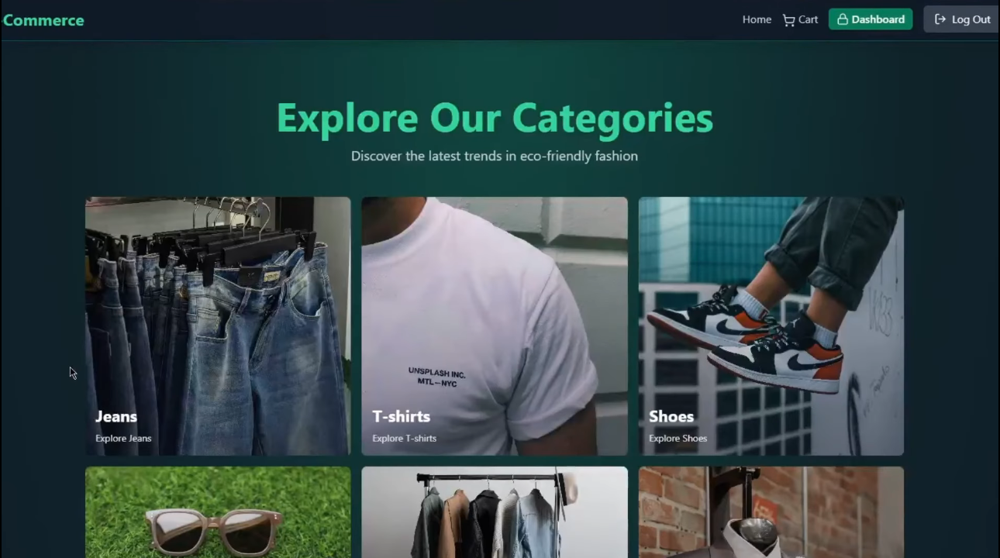

# E-Commerce Store (MERN) — Backend Ready, React Frontend 



An e-commerce store project built with the **MERN** stack.  
Currently this repository contains the **backend (Node.js + Express + MongoDB)** and API routes; the **frontend is being developed using React**.

### Components & Features
- 🚀 Project Setup
- 🗄️ MongoDB & Redis Integration
- 💳 Stripe Payment Setup
- 🔐 Robust Authentication System
- 🔑 JWT with Refresh/Access Tokens
- 📝 User Signup & Login
- 🛒 E-Commerce Core
- 📦 Product & Category Management
- 🛍️ Shopping Cart Functionality
- 💰 Checkout with Stripe
- 🏷️ Coupon Code System
- 👑 Admin Dashboard
- 📊 Sales Analytics
- 🎨 Design with Tailwind
- 🛒 Cart & Checkout Process
- 🔒 Security
- 🛡️ Data Protection
- 🚀Caching with Redis

---

## Tech Stack

### Backend
- **Node.js** (ES Modules)
- **Express**
- **MongoDB + Mongoose**
- **JWT Authentication**
- **Cookies** (`cookie-parser`)
- **Stripe** (payments)
- **Cloudinary** (image/media)
- **Redis** (`ioredis`) *(for caching / sessions depending on implementation)*

### Frontend (Planned)
- **React** (Vite)
- **Tailwind CSS** (styling)

---

## Project Structure

```
.
├── backend/
│   ├── connections/        # DB connection logic
│   ├── controllers/        # Request handlers
│   ├── middleware/         # Auth & other middleware
│   ├── models/             # Mongoose schemas/models
│   ├── routes/             # API routes
│   └── server.js           # Express app entry point
├── package.json            # Backend scripts + dependencies
└── package-lock.json
```

---

## API Routes (Backend)

The Express server registers these base routes:

- `GET/POST ... /api/auth` → Authentication routes
- `GET/POST ... /api/products` → Product routes
- `GET/POST ... /api/cart` → Cart routes
- `GET/POST ... /api/coupons` → Coupon routes
- `GET/POST ... /api/payments` → Payment routes (Stripe)
- `GET/POST ... /api/analytics` → Analytics routes

> Exact endpoints depend on the implementation inside `backend/routes/*.route.js`.

---

## Getting Started (Backend)

### 1) Prerequisites
- Node.js (recommended: latest LTS)
- MongoDB (local or Atlas)
- (Optional) Redis
- (Optional) Stripe + Cloudinary accounts/keys

### 2) Install dependencies
From the repository root:

```bash
npm install
```

### 3) Environment Variables
Create a `.env` file in the repository root (because `backend/server.js` loads dotenv at runtime).

Example :

```env
PORT=5001
MONGO_URI=your_mongodb_connection_string
JWT_SECRET=your_jwt_secret

# Stripe
STRIPE_SECRET_KEY=your_stripe_secret_key

# Cloudinary
CLOUDINARY_CLOUD_NAME=xxxx
CLOUDINARY_API_KEY=xxxx
CLOUDINARY_API_SECRET=xxxx

# Redis (optional, if used in code)
REDIS_URL=redis://localhost:6379
```

### 4) Run the backend
Development mode (nodemon):

```bash
npm run dev
```

Server will start at:

- `http://localhost:5001`

---

## Frontend (React) — Planned Setup

The frontend is not yet included in this repository. The Plan approach is:

- create a new folder like `frontend/`
- scaffold React app (Vite recommended)

Example:

```bash
mkdir frontend
cd frontend
npm create vite@latest . -- --template react
npm install
npm run dev
```

Then the React app can call the backend APIs (example base URL):
- `http://localhost:5001/api/...`

---

## Scripts

From `package.json` (root):

- `npm run dev` — runs backend using nodemon
- `npm start` — runs backend using nodemon

---

## Notes / Next Steps

- [ ] Build the **React frontend** (pages: Home, Product List, Product Details, Cart, Checkout, Login/Register, Admin dashboards)
- [ ] Add CORS configuration (if frontend runs on a different port/domain)
- [ ] Add API documentation (Swagger/OpenAPI) if needed
- [ ] Add Docker / DevOps pipeline 
